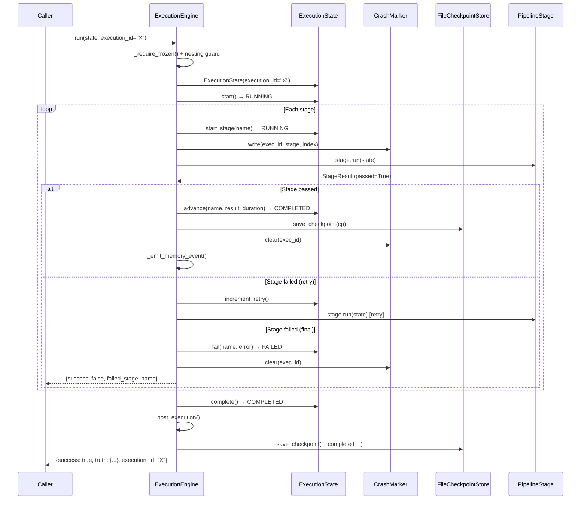
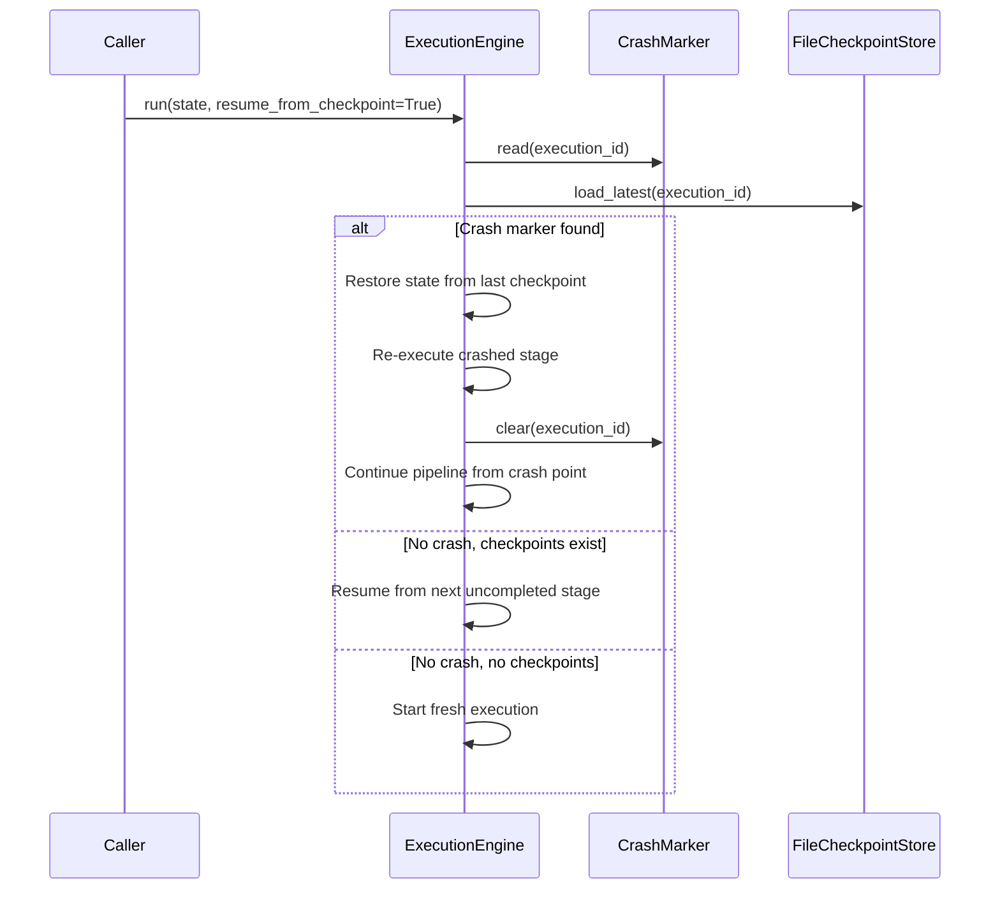

# Checkpoint Lifecycle — Sequence Diagram

```mermaid
sequenceDiagram
    participant Caller
    participant Engine as ExecutionEngine
    participant Lifecycle as ExecutionState
    participant Crash as CrashMarker
    participant Store as FileCheckpointStore
    participant Pipeline as PipelineStage

    Caller->>Engine: run(state, execution_id="X")
    Engine->>Engine: _require_frozen() + nesting guard
    Engine->>Lifecycle: ExecutionState(execution_id="X")
    Engine->>Lifecycle: start() → RUNNING

    loop Each stage
        Engine->>Lifecycle: start_stage(name) → RUNNING
        Engine->>Crash: write(exec_id, stage, index)
        Engine->>Pipeline: stage.run(state)
        Pipeline-->>Engine: StageResult(passed=True)

        alt Stage passed
            Engine->>Lifecycle: advance(name, result, duration) → COMPLETED
            Engine->>Store: save_checkpoint(cp)
            Engine->>Crash: clear(exec_id)
            Engine->>Engine: _emit_memory_event()
        else Stage failed (retry)
            Engine->>Lifecycle: increment_retry()
            Engine->>Pipeline: stage.run(state) [retry]
        else Stage failed (final)
            Engine->>Lifecycle: fail(name, error) → FAILED
            Engine->>Crash: clear(exec_id)
            Engine-->>Caller: {success: false, failed_stage: name}
        end
    end

    Engine->>Lifecycle: complete() → COMPLETED
    Engine->>Engine: _post_execution()
    Engine->>Store: save_checkpoint(__completed__)
    Engine-->>Caller: {success: true, truth: {...}, execution_id: "X"}
```

## Crash Recovery Flow

```mermaid
sequenceDiagram
    participant Caller
    participant Engine as ExecutionEngine
    participant Crash as CrashMarker
    participant Store as FileCheckpointStore

    Caller->>Engine: run(state, resume_from_checkpoint=True)
    Engine->>Crash: read(execution_id)
    Engine->>Store: load_latest(execution_id)

    alt Crash marker found
        Engine->>Engine: Restore state from last checkpoint
        Engine->>Engine: Re-execute crashed stage
        Engine->>Crash: clear(execution_id)
        Engine->>Engine: Continue pipeline from crash point
    else No crash, checkpoints exist
        Engine->>Engine: Resume from next uncompleted stage
    else No crash, no checkpoints
        Engine->>Engine: Start fresh execution
    end
```
