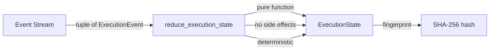

# Event Reduction Flow — Phase 4B

## Pure Functional Reducer



## Reduction Algorithm

```
Input:  Tuple[ExecutionEvent, ...]
Output: ExecutionState

1. Initialize ExecutionState(execution_id)
2. For each event in sequence order:
   a. Match event_type:
      - EXECUTION_STARTED  → .start()
      - STAGE_STARTED      → .start_stage(name)
      - STAGE_COMPLETED    → .advance(name, result, duration)
      - STAGE_FAILED       → .fail(name, error)
      - EXECUTION_COMPLETED → .complete()
      - EXECUTION_FAILED   → .fail(name, error)
      - EXECUTION_CRASHED  → .crash()
      - RETRY_INCREMENTED  → .increment_retry()
      - EVENT_RECORDED     → .increment_event()
      - FORK_CREATED       → (no-op, tracked in payload)
      - REPLAY_STARTED     → (no-op, metadata only)
      - REPLAY_COMPLETED   → (no-op, metadata only)
   b. Each mutation returns NEW ExecutionState
3. Return final ExecutionState
```

## Event → State Mapping

| Event | State Transition | New Fields |
|-------|-----------------|------------|
| EXECUTION_STARTED | PENDING → RUNNING | started_at set |
| STAGE_STARTED | stage → RUNNING | current_stage, stage_progress++ |
| STAGE_COMPLETED | stage → COMPLETED | completed_stages++, result stored |
| STAGE_FAILED | stage → FAILED | error stored |
| EXECUTION_COMPLETED | RUNNING → COMPLETED | completed_at set |
| EXECUTION_FAILED | RUNNING → FAILED | error stored |
| EXECUTION_CRASHED | RUNNING → CRASHED | crash marker |
| RETRY_INCREMENTED | (no status change) | retry_count++ |
| EVENT_RECORDED | (no status change) | event_count++ |

## Determinism Guarantees

1. **Same events → same state**: Pure function, no randomness, no I/O
2. **Event order**: Monotonic sequence numbers enforce total order
3. **Hash chain**: Each event hashes its content; parent_event_id links chain
4. **Fingerprint**: `event_stream_fingerprint()` produces deterministic hash of entire stream

## Verification

```
reduce_execution_state(events, eid) executed 100 times:
  → All 100 results have identical fingerprint()
  → Input events tuple is unchanged after reduction
  → No global state modified during reduction
```
