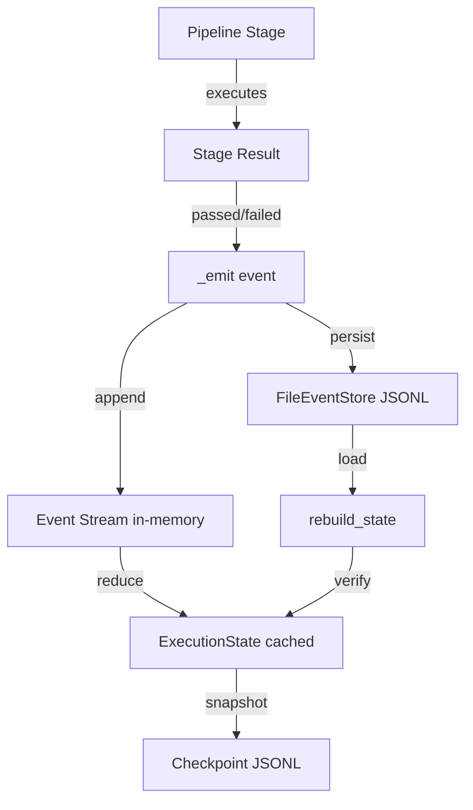

# Event Sourcing Architecture — Phase 4B

**Generated:** 2026-05-24
**Phase:** 4B — Event-Sourced Runtime + Time Travel Execution

---

## Architecture Shift

```
Phase 4A (before):                    Phase 4B (after):
  ExecutionState snapshots              ExecutionEvents
       + checkpoints                    → reducer (pure function)
       = state tracking                 → ExecutionState (projection)
                                        + checkpoints (optimization snapshots)

  State-first model                    Event-first model
  Direct lifecycle mutation            All mutation via _emit()
  Checkpoints authoritative            Events authoritative
```

---

## Module Dependency Graph (Post-4B)

```
events.py            (stdlib only, zero v3 imports)
    ^
event_store.py       (imports events)
    ^
time_travel.py       (imports events + execution_state)
    ^       ^
replay.py            (imports events + event_store + execution_state)
    ^
execution_engine.py  (imports all above + memory_gateway + truth_model + invariants)
    ^
__init__.py           (imports all)
```

**Zero circular dependencies.** All leaf modules LLM-free.

---

## Event Type Hierarchy

```
ExecutionEvent (base, frozen dataclass)
  Fields: event_id, execution_id, timestamp, sequence, event_type,
          payload, parent_event_id, deterministic_hash

Event Types (12 closed-set values):
  execution_started      — Pipeline begins
  stage_started          — Stage begins executing
  stage_completed        — Stage passes
  stage_failed           — Stage fails (after retries)
  execution_completed    — All stages pass
  execution_failed       — Pipeline fails
  execution_crashed      — Unexpected termination
  retry_incremented      — Retry count increased
  event_recorded         — Checkpoint/memory event emitted
  fork_created           — New execution branch created
  replay_started         — Replay begins
  replay_completed       — Replay finishes
```

---

## Data Flow



---

## Key Properties

| Property | Mechanism |
|----------|-----------|
| Immutability | Frozen dataclasses, tuple event stream |
| Append-only | FileEventStore uses `open("a")` only |
| Determinism | Pure functional reducer, no side effects |
| Reconstructability | All state derivable from event stream |
| Fork isolation | New execution_id per fork, independent streams |
| Integrity | validate_event_stream checks sequences, hashes, chains |
