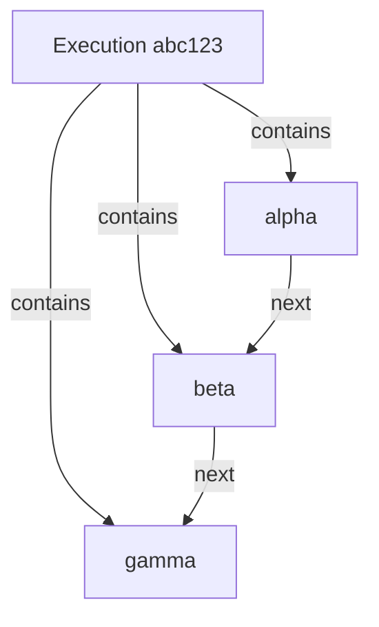
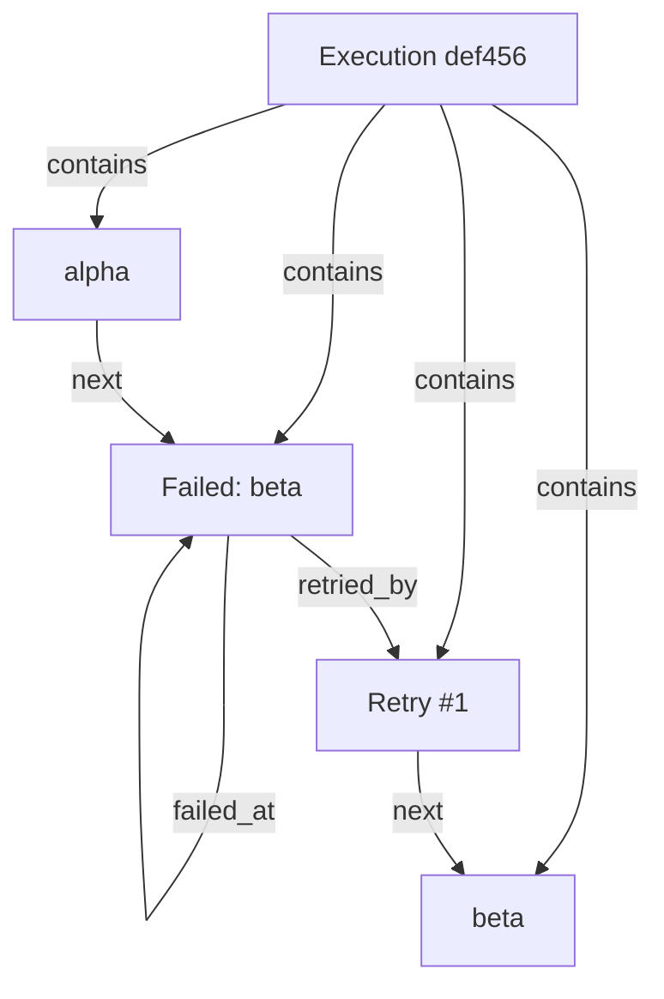

# Runtime Graph Model — Phase 4C

## RuntimeNode Types

| node_type | Description | Example Label | status |
|-----------|-------------|---------------|--------|
| `execution` | Root node for the entire execution | `Execution abc123def456` | `ok` |
| `stage` | One pipeline stage | `alpha`, `build`, `test` | `ok` |
| `error` | A stage that failed | `Failed: beta` | `failed` |
| `retry` | A retry increment event | `Retry #1` | `ok` |
| `fork` | A fork creation event | `Fork from abc123def456` | `ok` |
| `checkpoint` | A checkpoint/event-recorded event | `Snapshot #1` | `snapshot` |

### RuntimeNode Fields

```
node_id         : str   — unique identifier within the graph
node_type       : str   — one of NodeType values
label           : str   — human-readable label
sequence_start  : int   — first event sequence in this node's span
sequence_end    : int   — last event sequence in this node's span
status          : str   — "ok" | "failed" | "snapshot"
metadata        : dict  — node-type-specific data
```

## RuntimeEdge Types

| edge_type | Direction | Meaning |
|-----------|-----------|---------|
| `next` | A → B | Stage B follows Stage A (sequential ordering) |
| `contains` | Execution → Node | Execution contains this stage/error/fork |
| `failed_at` | Stage → Error | Stage failed at this error node |
| `retried_by` | Node → Retry | Previous node triggered a retry |
| `forked_from` | Execution → Fork | Execution was forked at this point |
| `checkpointed_at` | Node → Checkpoint | A checkpoint snapshot was taken after this node |

### RuntimeEdge Fields

```
source     : str   — source node_id
target     : str   — target node_id
edge_type  : str   — one of EdgeType values
sequence   : int   — edge ordering within the graph
metadata   : dict  — edge-type-specific data
```

## Mermaid Diagram Example

A successful 3-stage execution:



A failed execution with retry:



## graph_hash Rules

The `graph_hash` is a deterministic SHA-256 (first 16 hex chars) computed from:

```
graph_hash = SHA256(
    execution_id |
    sorted_nodes_content |
    sorted_edges_content |
    stage_order |
    event_count | failure_count | retry_count |
    checkpoint_count | fork_count | duration_ms
)
```

Where:
- `sorted_nodes_content` = each node's `node_id:node_type:label:sequence_start:sequence_end:status`
- `sorted_edges_content` = each edge's `source->target:edge_type:sequence`

**Invariant:** Same event stream → same graph_hash, always. No exceptions.

## Determinism Guarantees

| Operation | Deterministic? | Basis |
|-----------|---------------|-------|
| `build_graph(events)` | Yes | Pure function of event content only |
| `compute_metrics(events)` | Yes | All data from event payloads |
| `compute_telemetry(events, graph)` | Yes | All checks are structural |
| `graph_hash` | Yes | Content-addressed (SHA-256) |
| `metrics_fingerprint` | Yes | Content-addressed |
| `telemetry_fingerprint` | Yes | Content-addressed |

No wall clock, no random seeds, no external state.
