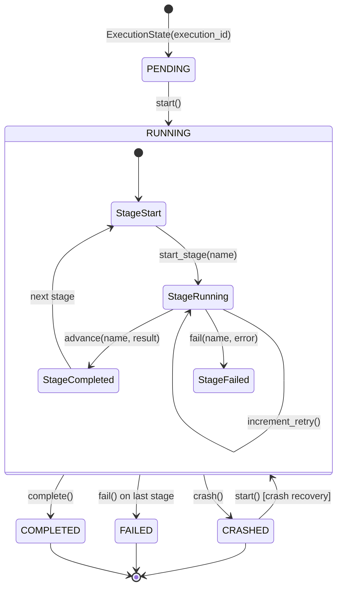
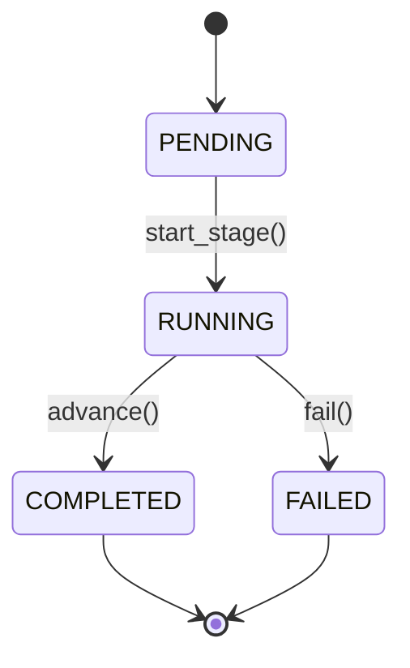

# Runtime State Transition Diagram — Phase 4A

## ExecutionState Lifecycle



## StageProgress per-stage transitions



## ExecutionStatus Enum

| Status | Description |
|--------|-------------|
| PENDING | Execution created but not yet started |
| RUNNING | Pipeline is actively executing stages |
| COMPLETED | All pipeline stages passed successfully |
| FAILED | A stage failed after exhausting retries |
| CRASHED | Unexpected termination (detected via CrashMarker) |

## StageStatus Enum

| Status | Description |
|--------|-------------|
| PENDING | Stage not yet started |
| RUNNING | Stage currently executing |
| COMPLETED | Stage passed |
| FAILED | Stage failed (after retries) |

## Invariant: Immutable Transitions

Every transition returns a NEW `ExecutionState` instance. The original is never modified.

```python
es1 = ExecutionState(execution_id="X")
es2 = es1.start()      # es1.status == PENDING, es2.status == RUNNING
es3 = es2.advance(...) # es2 unchanged, es3 has updated completed_stages
```
