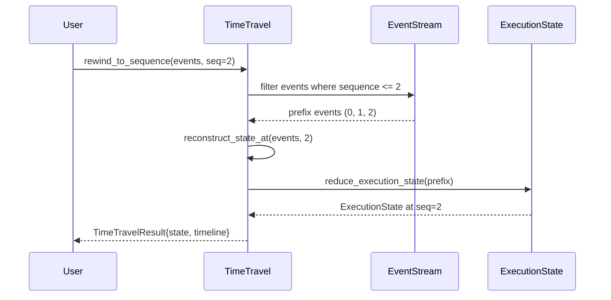
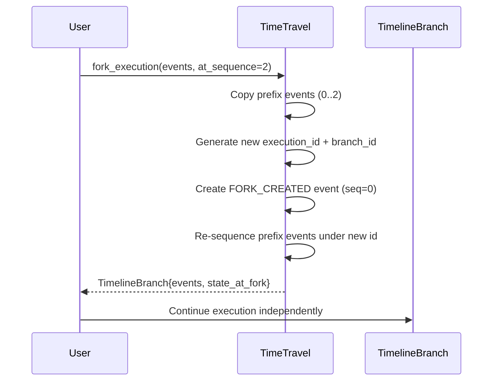
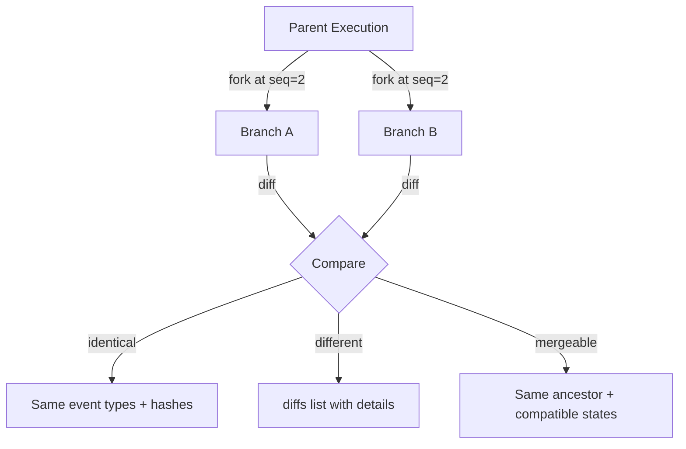
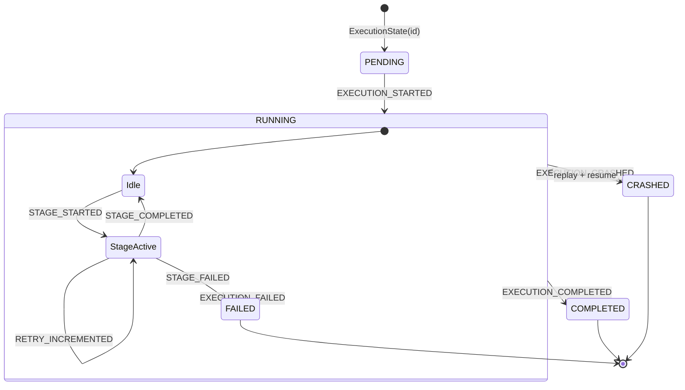

# Time Travel Runtime — Phase 4B

## Capabilities

1. **Rewind** — Go back to any sequence point in execution history
2. **Reconstruct** — Rebuild ExecutionState at any point in time
3. **Fork** — Create independent execution branches from any point
4. **Diff** — Compare two forked timelines
5. **Merge check** — Determine if branches can be merged

---

## Rewind to Sequence

## Execution Fork

## Timeline Comparison

## State Transition (event-driven)

